# Web Design for a Manufacturing Company
## AIM: 
To design a static website for a chip manufacturing company.

## DESIGN STEPS:
### Step 1: 
Requirement collection.
### Step 2:
Creating the layout using HTML and CSS.
### Step 3:
Updating the sample content.
### Step 4:
Choose the appropriate style and color scheme.
### Step 5:
Validate the layout in various browsers.
### Step 6:
Validate the HTML code.
### Step 6:
Publish the website in the given URL.

## PROGRAM:

### base.html
```

<!DOCTYPE html>
<html lang="en">

<head>
    <title>Zinc Private Limited</title>
    <link rel="stylesheet" href="">
    <link rel = "icon" href ="" type = "image/x-icon"> 
              
</head>

<body>
    <div class="container">
    <div class="banner">
        Zinc Private Limited.
    </div>
    <div class="menu">
        <div class="menuitem"><a href="/home">Home</a></div> 
        <div class="menuitem"><a href="/products">Products</a></div> 
        <div class="menuitem"><a href="/people">People</a></div>
        <div class="menuitem"><a href="/contactus">Contact Us</a></div> 
    </div><div class="content">
        
    
    </div>
    <div class="footer">
        Copyright © 2020 Silicon Private Limited, Developed by DurgaDevi.
    </div>
    </div>
</body>

</html>
```

### home.html
```



 <div class="homecontent">    
    <h1>About Us</h1>
    
    <div class="contenttext">
    Silicon Pvt Ltd, provides a broad range of semiconductor and infrastructure software applications that serve the data center, networking, software, broadband, wireless, and storage and industrial markets. Common applications for its products include: data center networking, home connectivity, broadband access, telecommunications equipment, smartphones, base stations, data center servers and storage, factory automation, power generation and alternative energy systems, displays, and mainframe operations and management, and application software development. Some of Silicon's core technologies and products include:
    <ul>
        <li>Memory Chips</li>
        <li>SATA HDD</li>
        <li>SATA SSD </li>
        <li>Broadband Modems</li>
        <li>Wifi Devices</li>
        <li>Switching Devices</li>
        <li>Optical Sensors</li>
    </ul> 
    </div>
    </div>
    
```
### products.html
```



 <div class="productcontent">    
    <h1>Our Premium Products</h1>
    <div class="productitems">
        <div class="productitem"> 
            <div class="itemimage">
            
            </div>
            <div class="itemname">Tin zinc wire</div>
            <div class="itemprice">Price: Rs.3000.00 </div>
        </div>
        <div class="productitem"> 
            <div class="itemimage">
            
            </div>
            <div class="itemname">Zinc alloy scrap</div>
            <div class="itemprice">Price: Rs.8000.00 </div>
        </div>
        <div class="productitem"> 
            <div class="itemimage">
            
            </div>
            <div class="itemname">Zamark 5 zinc alloy</div>
            <div class="itemprice">Price: Rs.10000.00 </div>
        </div>
        <div class="productitem"> 
            <div class="itemimage">
            
            </div>
            <div class="itemname">zinc alluminium roffing sheet </div>
            <div class="itemprice">Price: Rs.4000.00 </div>
        </div>
        <div class="productitem"> 
            <div class="itemimage">
            
            </div>
            <div class="itemname">Zinc ingot</div>
            <div class="itemprice">Price: Rs.6000.00 </div>
        </div>
        <div class="productitem"> 
            <div class="itemimage">
            
            </div>
            <div class="itemname">Zinc slap</div>
            <div class="itemprice">Price: Rs.7000.00 </div>
        </div>
        <div class="productitem"> 
            <div class="itemimage">
            
            </div>
            <div class="itemname">Zinc rich epoxy coating</div>
            <div class="itemprice">Price: Rs.2560.00 </div>
        </div>
        <div class="productitem"> 
            <div class="itemimage">
            
            </div>
            <div class="itemname">Zinc strips</div>
            <div class="itemprice">Price: Rs.12000.00 </div>
        </div>
        <div class="productitem"> 
            <div class="itemimage">
            
            </div>
            <div class="itemname">Zinc round bar</div>
            <div class="itemprice">Price: Rs.7800.00 </div>
        </div>
        <div class="productitem"> 
            <div class="itemimage">
            
            </div>
            <div class="itemname">Zinc sheet</div>
            <div class="itemprice">Price: Rs.9000.00 </div>
        </div>
        <div class="productitem"> 
            <div class="itemimage">
            
            </div>
            <div class="itemname">Zinc dross3 </div>
            <div class="itemprice">Price: Rs.4000.00 </div>
        </div>
        <div class="productitem"> 
            <div class="itemimage">
            
            </div>
            <div class="itemname">Zinc coated flat</div>
            <div class="itemprice">Price: Rs.1300.00 </div>
        </div>
        

    </div>
    </div>
   
```
### people.html
```



<div>
    <h1>Our team</h1>
    <div>
        <div>
            <div>
                
            </div>
            <h2>Arun kumar</h2>
            <h4>Chief financial officer </h4>
        </div>
        <div>
            <div>
                
            </div>
            <h2>Priya agarval</h2>
            <h4>Non executive director </h4>
        </div>
        <div>
            <div>
                
            </div>
            <h2>Lalitta.D Gupte</h2>
            <h4>Independent director </h4>
        </div>
        <div>
            <div>
                
            </div>
            <h2>Sharma</h2>
            <h4> Chief Financial Officer </h4>
        </div>
        <div>
            <div>
                
            </div>
            <h2>Anil agarval</h2>
            <h4>Intrium CEO </h4>
        </div>
        <div>
            <div>
                
            </div>
            <h2>Sunil duggal </h2>
            <h4>Non exesecutive chairman </h4>
        </div>
    </div>
</div>

```
### contactus.html
```


<div>
    <h1>Contact details</h1>
    <div>
        <h2>Tamilnadu</h2>
            <h4>Mr.Abishek Bhalotia</h4>
            <h3>Phone Number:</h3>
            <h4>044-894532</h4>
            <h2>Kerala</h2>
            <h4>Mr.Anil agarval</h4>
            <h3>Phone Number:</h3>
            <h4>044-564980</h4>
            <h2>Karnataka</h2>
            <h4>Mr.Sharma</h4>
            <h3>Phone Number:</h3>
            <h4>8976543427</h4>
            <h2></h2>Andra pradesh
            <h4>Mr.isak</h4>
            <h3>Phone Number:</h3>
            <h4>7865432913</h4>
            <h2>E-mail</h2>
            <h3>Zincpvtltd@gmail.com</h3>


       </div>
</div>


```

## OUTPUT:
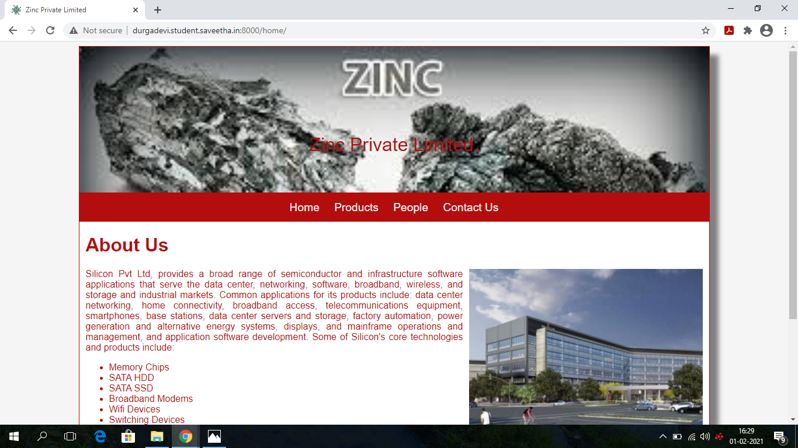

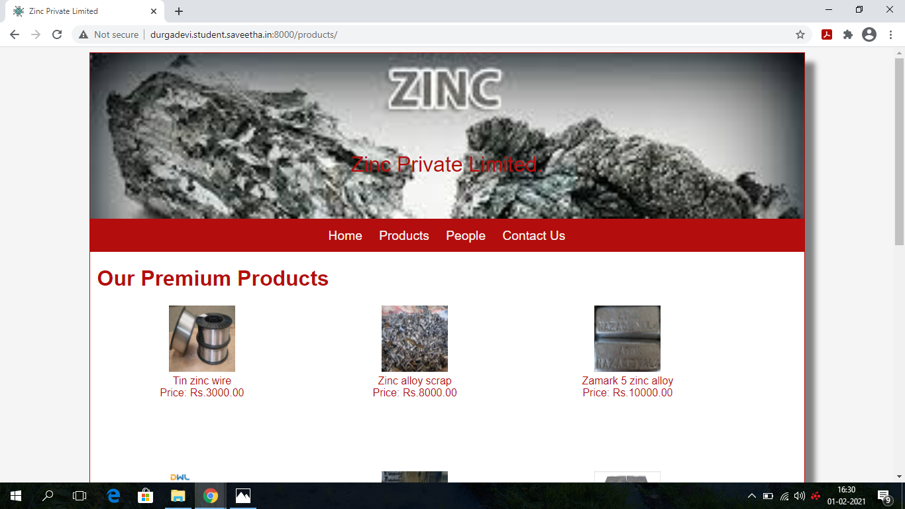

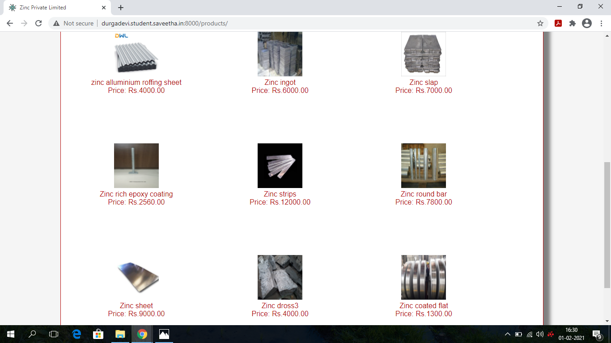

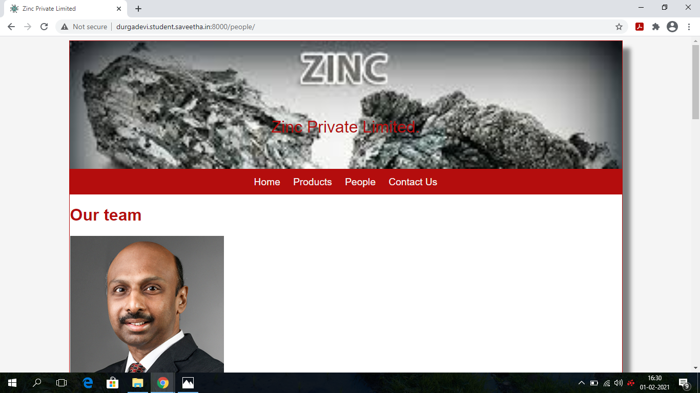

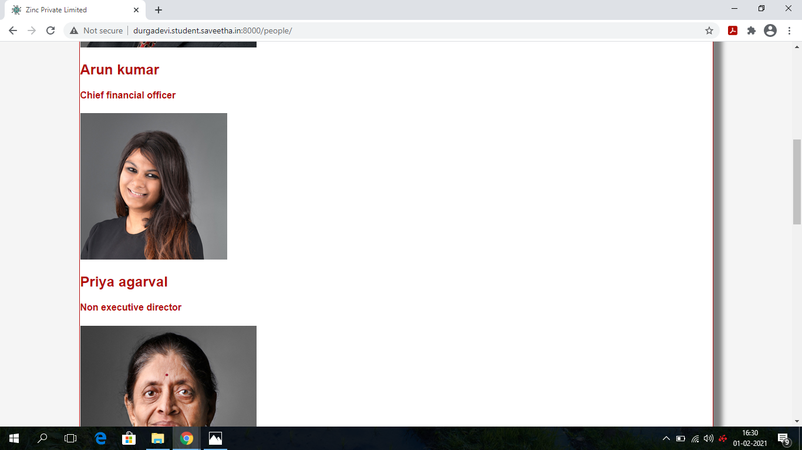


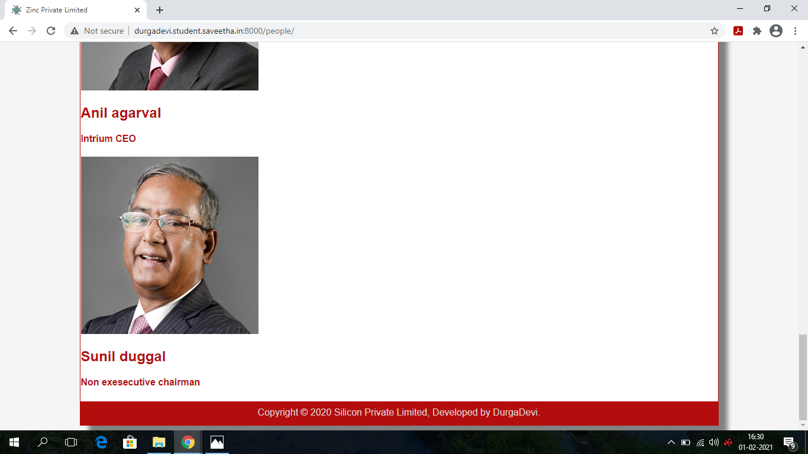

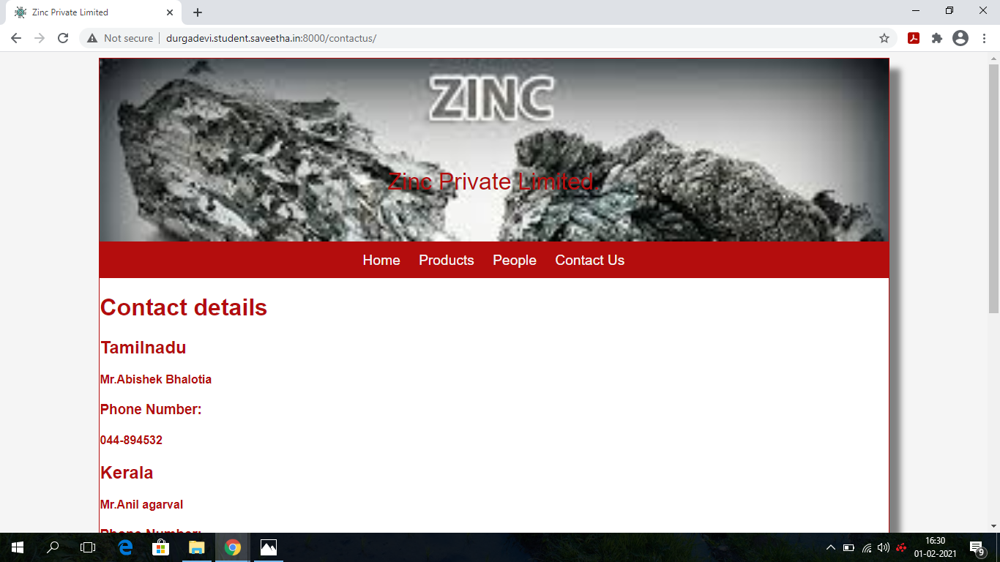

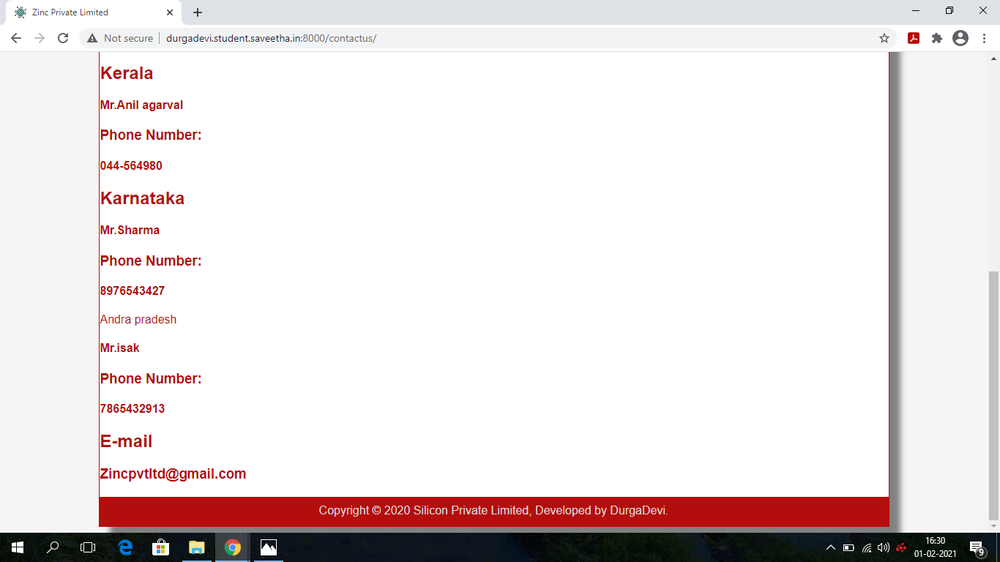


## CODE VALIDATION REPORT:
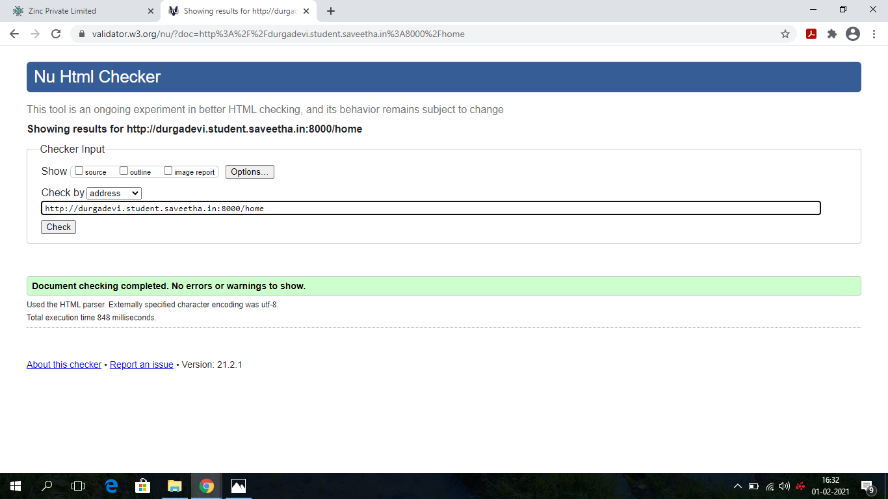

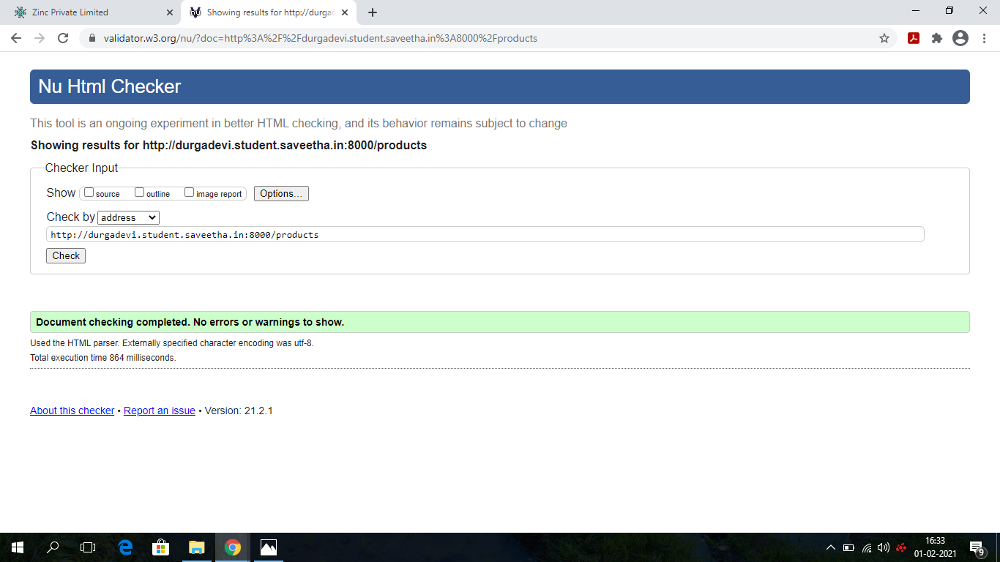


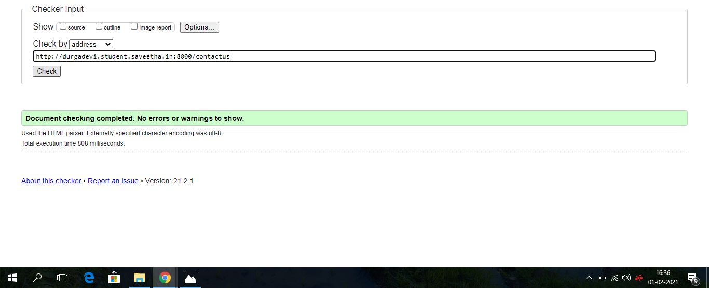
## RESULT:
Thus a website is designed for the chip manufacturing company and is hosted in the URL http://durgadevi.student.saveetha.in:8000/. HTML code is validated.